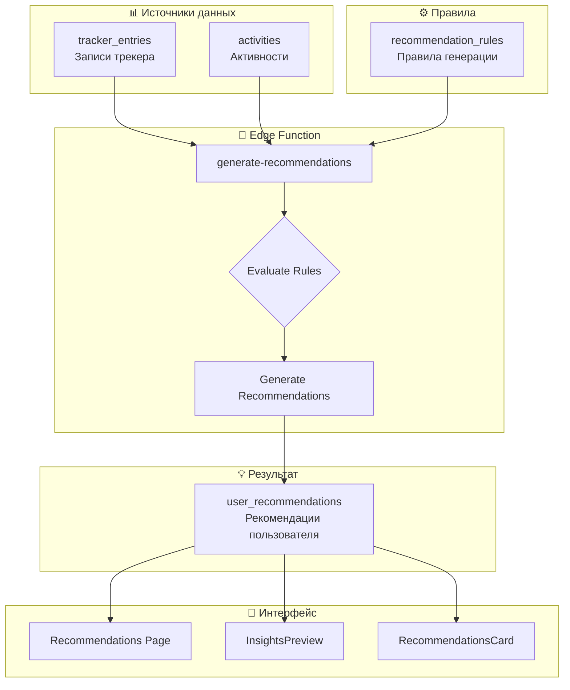
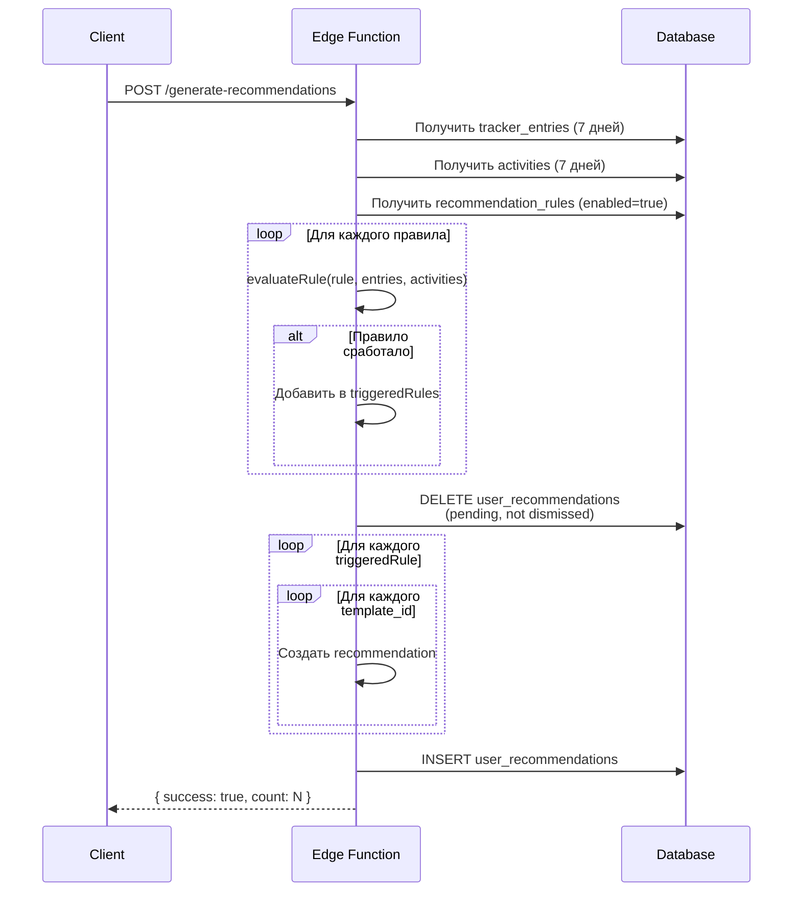
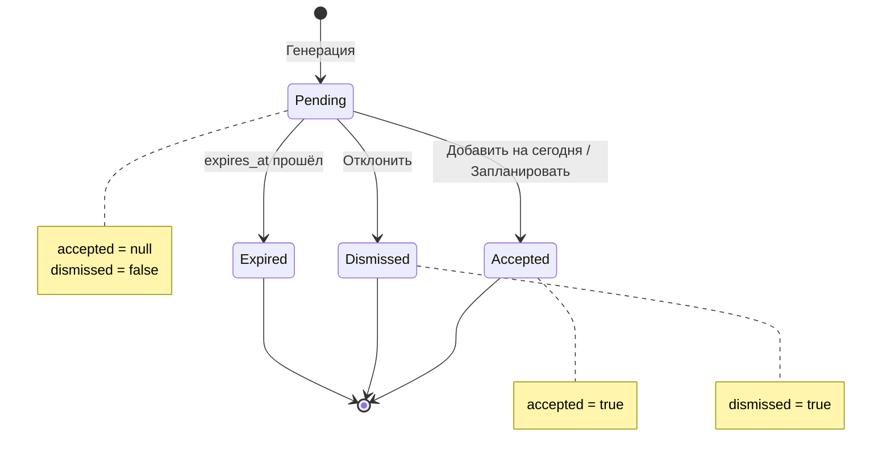

# Раздел Recommendations (/recommendations)

## Общее описание

Recommendations — интеллектуальная система персональных рекомендаций активностей, которая анализирует данные трекеров настроения и историю активностей пользователя. На основе настраиваемых правил система генерирует персонализированные предложения для улучшения самочувствия.

---

## Структура файлов

```
src/
├── pages/
│   └── Recommendations.tsx              # Главная страница рекомендаций
├── components/
│   ├── dashboard/
│   │   └── InsightsPreview.tsx          # Превью на дашборде
│   └── insights/
│       └── RecommendationsCard.tsx      # Карточка рекомендаций в Insights
supabase/
└── functions/
    └── generate-recommendations/
        └── index.ts                     # Edge Function генерации рекомендаций
```

---

## Архитектура системы рекомендаций



---

## Типы триггеров (Trigger Conditions)

Система поддерживает три типа триггеров для генерации рекомендаций:

### 1. Tracker Threshold (Порог метрики трекера)

Срабатывает когда метрика трекера превышает/не достигает порогового значения определённое количество раз за период.

```typescript
interface TrackerThresholdCondition {
  type: 'tracker_threshold';
  metric: 'stress_level' | 'anxiety_level' | 'energy_level' | 'mood_score';
  operator: '>' | '<' | '>=' | '<=' | '=';
  value: number;
  occurrences: number;    // Минимальное количество совпадений
  period_hours: number;   // Период анализа в часах
}

// Примеры:
// Высокий стресс (>= 7) 3+ раза за 48 часов
{ type: 'tracker_threshold', metric: 'stress_level', operator: '>=', value: 7, occurrences: 3, period_hours: 48 }

// Низкая энергия (<= 2) 2+ раза за 24 часа
{ type: 'tracker_threshold', metric: 'energy_level', operator: '<=', value: 2, occurrences: 2, period_hours: 24 }

// Плохое настроение (<= -2) 4+ раза за 72 часа
{ type: 'tracker_threshold', metric: 'mood_score', operator: '<=', value: -2, occurrences: 4, period_hours: 72 }
```

**Метрики и их диапазоны:**

| Метрика | Диапазон | Описание |
|---------|----------|----------|
| `stress_level` | 0-10 | Уровень стресса (0 = нет, 10 = максимум) |
| `anxiety_level` | 0-10 | Уровень тревожности |
| `energy_level` | -5 to +5 | Уровень энергии (отрицательные = усталость) |
| `mood_score` | -5 to +5 | Настроение (отрицательные = плохое) |

### 2. Activity Deficit (Дефицит активности)

Срабатывает когда время выполнения активностей определённой категории меньше целевого.

```typescript
interface ActivityDeficitCondition {
  type: 'activity_deficit';
  category: string;         // Категория активности
  target_hours: number;     // Целевых часов В ДЕНЬ
  period_days: number;      // Период анализа в днях
}

// Примеры:
// Меньше 8 часов сна в день за последние 3 дня
{ type: 'activity_deficit', category: 'sleep', target_hours: 8, period_days: 3 }

// Меньше 0.5 часа медитации в день за неделю
{ type: 'activity_deficit', category: 'meditation', target_hours: 0.5, period_days: 7 }

// Меньше 1 часа упражнений в день за 5 дней
{ type: 'activity_deficit', category: 'exercise', target_hours: 1, period_days: 5 }
```

### 3. Activity Absence (Отсутствие активности)

Срабатывает когда нет завершённых активностей определённой категории за период.

```typescript
interface ActivityAbsenceCondition {
  type: 'activity_absence';
  category: string;       // Категория активности
  period_days: number;    // Период анализа в днях
}

// Примеры:
// Нет упражнений за 3 дня
{ type: 'activity_absence', category: 'exercise', period_days: 3 }

// Нет медитации за 2 дня
{ type: 'activity_absence', category: 'meditation', period_days: 2 }

// Нет социальных активностей за неделю
{ type: 'activity_absence', category: 'social', period_days: 7 }
```

---

## Таблица правил (recommendation_rules)

```sql
CREATE TABLE recommendation_rules (
  id UUID PRIMARY KEY DEFAULT gen_random_uuid(),
  trigger_condition JSONB NOT NULL,        -- Условие срабатывания
  activity_template_ids UUID[] NOT NULL,   -- Массив ID рекомендуемых шаблонов
  priority INTEGER DEFAULT 3,              -- Приоритет (1=высокий, 2=средний, 3+=низкий)
  enabled BOOLEAN DEFAULT TRUE,            -- Активно ли правило
  created_at TIMESTAMPTZ DEFAULT now()
);
```

### Примеры правил

```sql
-- Правило: При высоком стрессе рекомендовать медитацию и дыхательные упражнения
INSERT INTO recommendation_rules (trigger_condition, activity_template_ids, priority) VALUES (
  '{"type": "tracker_threshold", "metric": "stress_level", "operator": ">=", "value": 7, "occurrences": 2, "period_hours": 48}',
  ARRAY['uuid-meditation', 'uuid-breathing']::uuid[],
  1
);

-- Правило: При низкой энергии рекомендовать прогулку и лёгкие упражнения
INSERT INTO recommendation_rules (trigger_condition, activity_template_ids, priority) VALUES (
  '{"type": "tracker_threshold", "metric": "energy_level", "operator": "<=", "value": -2, "occurrences": 2, "period_hours": 24}',
  ARRAY['uuid-walk', 'uuid-light-exercise']::uuid[],
  2
);

-- Правило: Нет упражнений 3 дня - рекомендовать активность
INSERT INTO recommendation_rules (trigger_condition, activity_template_ids, priority) VALUES (
  '{"type": "activity_absence", "category": "exercise", "period_days": 3}',
  ARRAY['uuid-morning-exercise', 'uuid-yoga']::uuid[],
  2
);

-- Правило: Недостаточно сна - рекомендовать отдых
INSERT INTO recommendation_rules (trigger_condition, activity_template_ids, priority) VALUES (
  '{"type": "activity_deficit", "category": "sleep", "target_hours": 7, "period_days": 3}',
  ARRAY['uuid-nap', 'uuid-quiet-rest']::uuid[],
  1
);
```

---

## Алгоритм генерации рекомендаций (Edge Function)



### Логика оценки правил

```typescript
// Основная функция оценки
function evaluateRule(rule: Rule, trackerEntries: any[], activities: any[]): boolean {
  const condition = rule.trigger_condition;

  switch (condition.type) {
    case 'tracker_threshold':
      return evaluateTrackerThreshold(condition, trackerEntries);
    case 'activity_deficit':
      return evaluateActivityDeficit(condition, activities);
    case 'activity_absence':
      return evaluateActivityAbsence(condition, activities);
    default:
      return false;
  }
}

// Оценка порога трекера
function evaluateTrackerThreshold(condition, entries): boolean {
  const { metric, operator, value, occurrences, period_hours } = condition;
  
  // 1. Фильтруем записи за период
  const cutoffTime = new Date();
  cutoffTime.setHours(cutoffTime.getHours() - period_hours);
  
  const recentEntries = entries.filter(entry => {
    const entryDate = new Date(`${entry.entry_date}T${entry.entry_time}`);
    return entryDate >= cutoffTime && entry[metric] !== null;
  });
  
  // 2. Считаем совпадения с условием
  let count = 0;
  for (const entry of recentEntries) {
    const metricValue = entry[metric];
    if (operator === '>' && metricValue > value) count++;
    else if (operator === '<' && metricValue < value) count++;
    else if (operator === '>=' && metricValue >= value) count++;
    else if (operator === '<=' && metricValue <= value) count++;
    else if (operator === '=' && metricValue === value) count++;
  }
  
  // 3. Проверяем достижение порога
  return count >= occurrences;
}

// Оценка дефицита активности
function evaluateActivityDeficit(condition, activities): boolean {
  const { category, target_hours, period_days } = condition;
  
  // 1. Фильтруем завершённые активности категории за период
  const cutoffDate = new Date();
  cutoffDate.setDate(cutoffDate.getDate() - period_days);
  
  const relevantActivities = activities.filter(activity => 
    activity.category === category &&
    new Date(activity.date) >= cutoffDate &&
    activity.status === 'completed'
  );
  
  // 2. Считаем общее время
  const totalMinutes = relevantActivities.reduce((sum, a) => 
    sum + (a.duration_minutes || 0), 0
  );
  const totalHours = totalMinutes / 60;
  
  // 3. Сравниваем с целевым (target_hours * period_days)
  const targetTotalHours = target_hours * period_days;
  return totalHours < targetTotalHours;
}

// Оценка отсутствия активности
function evaluateActivityAbsence(condition, activities): boolean {
  const { category, period_days } = condition;
  
  const cutoffDate = new Date();
  cutoffDate.setDate(cutoffDate.getDate() - period_days);
  
  // Проверяем есть ли хоть одна завершённая активность
  const hasActivity = activities.some(activity => 
    activity.category === category &&
    new Date(activity.date) >= cutoffDate &&
    activity.status === 'completed'
  );
  
  return !hasActivity;
}
```

### Генерация причин рекомендаций

```typescript
function generateReason(condition: TriggerCondition): string {
  switch (condition.type) {
    case 'tracker_threshold':
      switch (condition.metric) {
        case 'stress_level': return 'To help reduce stress';
        case 'anxiety_level': return 'To calm anxiety';
        case 'energy_level': return 'To boost your energy';
        case 'mood_score': return 'To lift your mood';
        default: return 'For overall wellbeing';
      }
    case 'activity_deficit':
      if (condition.category === 'sleep') return 'You need more rest';
      return 'To maintain balance';
    case 'activity_absence':
      if (condition.category === 'exercise') return 'To stay active';
      if (condition.category === 'hydration') return 'Stay hydrated';
      return 'To maintain your routine';
    default:
      return 'For overall wellbeing';
  }
}
```

---

## Жизненный цикл рекомендации



### Срок действия рекомендаций

Рекомендации автоматически истекают через 24 часа после создания:

```typescript
const now = new Date();
const expiresAt = new Date(now.getTime() + 24 * 60 * 60 * 1000); // +24 часа

// При создании
recommendations.push({
  user_id: user.id,
  activity_template_id: templateId,
  reason: generateReason(rule.trigger_condition),
  priority: rule.priority,
  accepted: null,
  dismissed: false,
  expires_at: expiresAt.toISOString(),
});
```

---

## Связь с компонентами UI

### InsightsPreview (Dashboard)

Показывает топ-1 рекомендацию с высшим приоритетом:

```typescript
// src/components/dashboard/InsightsPreview.tsx
const fetchRecommendations = async () => {
  const { data } = await supabase
    .from('user_recommendations')
    .select(`*, activity_templates (name, emoji)`)
    .eq('user_id', user?.id)
    .is('accepted', null)           // Только pending
    .eq('dismissed', false)         // Не отклонённые
    .order('priority', { ascending: true })  // Сначала высокий приоритет
    .limit(1);

  setRecommendationCount(data?.length || 0);
  setTopRecommendation(data?.[0] || null);
};
```

### RecommendationsCard (Insights)

Генерирует рекомендации на основе локального анализа данных:

```typescript
// src/components/insights/RecommendationsCard.tsx
const recommendations = [];

// Проверка стресса/тревожности
const highStressEntries = trackerEntries.filter(e => 
  e.stress_level >= 7 || e.anxiety_level >= 7
);

if (highStressEntries.length > trackerEntries.length * 0.3) {
  recommendations.push({
    icon: Brain,
    title: 'Try stress-relief exercises',
    action: 'Browse Exercises',
    onClick: () => navigate('/exercises'),
  });
}

// Проверка выполнения активностей
const completionRate = completedActivities.length / activities.length;
if (completionRate < 0.5) {
  recommendations.push({
    icon: Activity,
    title: 'Focus on fewer activities',
    action: 'View Calendar',
    onClick: () => navigate('/calendar'),
  });
}
```

---

## Архитектура страницы

```
┌─────────────────────────────────────────────────────────────────┐
│  💡 Рекомендации                                   [🔄 Обновить]│
│  Персонально для вас                                            │
├─────────────────────────────────────────────────────────────────┤
│                                                                  │
│  ⚠️ ВНИМАНИЕ                                                     │
│  ┌─────────────────────────────────────────────────────────────┐ │
│  │ Обнаружены высокоприоритетные рекомендации.                 │ │
│  │ Рекомендуем принять меры.                                   │ │
│  └─────────────────────────────────────────────────────────────┘ │
│                                                                  │
│  🔴 HIGH PRIORITY                                                │
│  ┌─────────────────────────────────────────────────────────────┐ │
│  │ 🧘                                                     [✕]  │ │
│  │ [High] [High stress]                                        │ │
│  │ Медитация осознанности                                      │ │
│  │ Практика для снижения уровня стресса и тревожности          │ │
│  │ meditation • 15 min • restoring                             │ │
│  │ [+ Добавить на сегодня] [📅 Запланировать]                  │ │
│  └─────────────────────────────────────────────────────────────┘ │
│                                                                  │
│  🟡 MEDIUM PRIORITY                                              │
│  ┌─────────────────────────────────────────────────────────────┐ │
│  │ 🚶                                                     [✕]  │ │
│  │ [Medium] [Low energy]                                       │ │
│  │ Прогулка на свежем воздухе                                  │ │
│  │ Лёгкая физическая активность для повышения энергии          │ │
│  │ walks • 30 min • restoring                                  │ │
│  │ [+ Добавить на сегодня] [📅 Запланировать]                  │ │
│  └─────────────────────────────────────────────────────────────┘ │
│                                                                  │
│  💭 SUGGESTIONS                                                  │
│  ┌─────────────────────────────────────────────────────────────┐ │
│  │ 📚                                                     [✕]  │ │
│  │ [Low] [Balance]                                             │ │
│  │ Чтение                                                      │ │
│  │ Расслабляющее занятие для баланса                           │ │
│  │ reading • 30 min • restoring                                │ │
│  │ [+ Добавить на сегодня] [📅 Запланировать]                  │ │
│  └─────────────────────────────────────────────────────────────┘ │
│                                                                  │
└─────────────────────────────────────────────────────────────────┘
```

---

## Модель данных

### Recommendation

```typescript
interface Recommendation {
  id: string;
  user_id: string;
  activity_template_id: string;
  reason: string;                    // Причина рекомендации
  priority: number;                  // 1 = высокий, 2 = средний, 3+ = низкий
  accepted: boolean | null;          // true = принято, false = отклонено
  dismissed: boolean;                // Отклонено без действия
  expires_at: string | null;         // Срок действия
  created_at: string;
  
  // Join с activity_templates
  activity_templates: {
    name: string;
    emoji: string;
    category: string;
    impact_type: string;
    default_duration_minutes: number;
    description: string;
  };
}
```

### Таблица user_recommendations

```sql
CREATE TABLE user_recommendations (
  id UUID PRIMARY KEY,
  user_id UUID REFERENCES auth.users,
  activity_template_id UUID REFERENCES activity_templates,
  reason TEXT,                       -- 'High stress', 'Low energy', etc.
  priority INTEGER DEFAULT 3,        -- 1 = high, 2 = medium, 3+ = low
  accepted BOOLEAN,                  -- NULL = pending, TRUE/FALSE = decided
  dismissed BOOLEAN DEFAULT FALSE,
  expires_at TIMESTAMPTZ,
  created_at TIMESTAMPTZ DEFAULT now()
);
```

### Таблица recommendation_rules

```sql
CREATE TABLE recommendation_rules (
  id UUID PRIMARY KEY,
  trigger_condition JSONB,           -- Условие срабатывания
  activity_template_ids UUID[],      -- Рекомендуемые шаблоны
  priority INTEGER DEFAULT 3,
  enabled BOOLEAN DEFAULT TRUE,
  created_at TIMESTAMPTZ
);

-- Пример trigger_condition:
-- { "stress_level": { "gte": 7 } }
-- { "mood_score": { "lte": -2 } }
-- { "energy_level": { "lte": -3 } }
```

---

## Приоритеты рекомендаций

| Priority | Label | Badge Color | Описание |
|----------|-------|-------------|----------|
| 1 | High | `bg-destructive` | Срочные рекомендации (высокий стресс, низкое настроение) |
| 2 | Medium | `bg-warning` | Важные рекомендации (средние показатели) |
| 3+ | Low | `bg-muted` | Предложения для улучшения баланса |

---

## Причины рекомендаций (Reasons)

| Reason | Описание | Trigger |
|--------|----------|---------|
| `High stress` | Высокий уровень стресса | `stress_level >= 7` |
| `High anxiety` | Высокая тревожность | `anxiety_level >= 7` |
| `Low mood` | Плохое настроение | `mood_score <= -2` |
| `Low energy` | Низкая энергия | `energy_level <= -2` |
| `Balance` | Для баланса | По умолчанию |
| `Routine` | Регулярная практика | Нет активностей определённого типа |

---

## Загрузка рекомендаций

```typescript
const fetchRecommendations = async () => {
  const lang = i18n.language;
  
  const { data, error } = await supabase
    .from('user_recommendations')
    .select(`
      *,
      activity_templates (*)
    `)
    .eq('user_id', user?.id)
    .is('accepted', null)           // Только pending
    .eq('dismissed', false)         // Не отклонённые
    .order('priority', { ascending: true })
    .order('created_at', { ascending: false });

  // Локализация названий
  const mappedData = data.map(rec => ({
    ...rec,
    activity_templates: {
      name: rec.activity_templates[`name_${lang}`] || rec.activity_templates.name_en,
      description: rec.activity_templates[`description_${lang}`] || rec.activity_templates.description_en,
      // ...остальные поля
    }
  }));

  setRecommendations(mappedData);
  setHasHighPriority(mappedData.some(r => r.priority === 1));
};
```

---

## Генерация рекомендаций (Edge Function)

```typescript
// supabase/functions/generate-recommendations/index.ts
export default async function handler(req: Request) {
  const user = await getUser(req);
  
  // 1. Получить последние записи трекера
  const { data: entries } = await supabase
    .from('tracker_entries')
    .select('*')
    .eq('user_id', user.id)
    .order('created_at', { ascending: false })
    .limit(10);
  
  // 2. Анализ показателей
  const avgStress = average(entries.map(e => e.stress_level));
  const avgAnxiety = average(entries.map(e => e.anxiety_level));
  const avgMood = average(entries.map(e => e.mood_score));
  const avgEnergy = average(entries.map(e => e.energy_level));
  
  // 3. Получить правила
  const { data: rules } = await supabase
    .from('recommendation_rules')
    .select('*')
    .eq('enabled', true);
  
  // 4. Сопоставить правила с данными
  const recommendations = [];
  
  for (const rule of rules) {
    if (matchCondition(rule.trigger_condition, { avgStress, avgAnxiety, avgMood, avgEnergy })) {
      for (const templateId of rule.activity_template_ids) {
        recommendations.push({
          user_id: user.id,
          activity_template_id: templateId,
          reason: rule.trigger_condition.reason || 'Balance',
          priority: rule.priority,
        });
      }
    }
  }
  
  // 5. Удалить старые и вставить новые
  await supabase
    .from('user_recommendations')
    .delete()
    .eq('user_id', user.id)
    .is('accepted', null);
  
  await supabase
    .from('user_recommendations')
    .insert(recommendations);
  
  return new Response(JSON.stringify({ success: true }));
}
```

---

## Действия с рекомендациями

### Добавить на сегодня

```typescript
const handleAddToToday = async (rec: Recommendation) => {
  const today = getLocalDateString();
  const now = new Date();
  const startTime = `${String(now.getHours()).padStart(2, '0')}:${String(now.getMinutes()).padStart(2, '0')}`;

  // 1. Создать активность
  await supabase.from('activities').insert([{
    user_id: user?.id,
    title: rec.activity_templates.name,
    category: rec.activity_templates.category,
    impact_type: rec.activity_templates.impact_type,
    date: today,
    start_time: startTime,
    duration_minutes: rec.activity_templates.default_duration_minutes,
    status: 'planned',
    template_id: rec.activity_template_id,
  }]);

  // 2. Пометить как принятую
  await supabase
    .from('user_recommendations')
    .update({ accepted: true })
    .eq('id', rec.id);

  fetchRecommendations();
};
```

### Запланировать (перейти в календарь)

```typescript
const handleSchedule = async (rec: Recommendation) => {
  // 1. Пометить как принятую
  await supabase
    .from('user_recommendations')
    .update({ accepted: true })
    .eq('id', rec.id);

  // 2. Перейти в календарь с предзаполненным шаблоном
  navigate('/calendar', { 
    state: { templateId: rec.activity_template_id } 
  });
};
```

### Отклонить

```typescript
const handleDismiss = async (recId: string) => {
  await supabase
    .from('user_recommendations')
    .update({ dismissed: true })
    .eq('id', recId);

  setRecommendations(prev => prev.filter(r => r.id !== recId));
};
```

---

## Группировка по приоритету

```typescript
const groupedRecs = {
  high: recommendations.filter(r => r.priority === 1),
  medium: recommendations.filter(r => r.priority === 2),
  low: recommendations.filter(r => r.priority >= 3),
};
```

---

## Цвета типов воздействия

```typescript
const getImpactColor = (impact: string) => {
  switch (impact) {
    case 'restoring': return 'text-green-600 dark:text-green-400';
    case 'depleting': return 'text-red-600 dark:text-red-400';
    case 'neutral': return 'text-orange-600 dark:text-orange-400';
    case 'mixed': return 'text-blue-600 dark:text-blue-400';
    default: return 'text-muted-foreground';
  }
};
```

---

## Пустое состояние

```
┌─────────────────────────────────────────────────────────────────┐
│                                                                  │
│                           ✨                                     │
│                                                                  │
│                    Всё отлично!                                 │
│                                                                  │
│         Нет новых рекомендаций. Продолжайте                     │
│         отслеживать настроение и активности                     │
│         для персональных предложений.                           │
│                                                                  │
│              [🔄 Проверить рекомендации]                        │
│                                                                  │
└─────────────────────────────────────────────────────────────────┘
```

---

## Интеграция с Dashboard

На Dashboard отображается `InsightsPreview` — превью топ-1 рекомендации:

```typescript
// components/dashboard/InsightsPreview.tsx
const fetchRecommendations = async () => {
  const { data } = await supabase
    .from('user_recommendations')
    .select(`*, activity_templates (name, emoji)`)
    .eq('user_id', user?.id)
    .is('accepted', null)
    .eq('dismissed', false)
    .order('priority', { ascending: true })
    .limit(1);

  setRecommendationCount(data?.length || 0);
  setTopRecommendation(data?.[0] || null);
};
```
